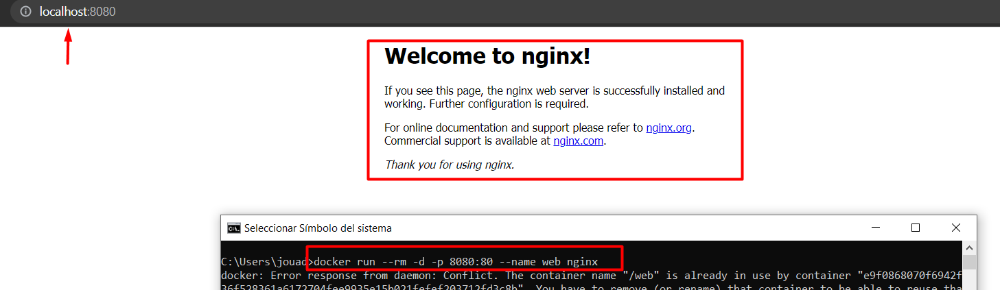
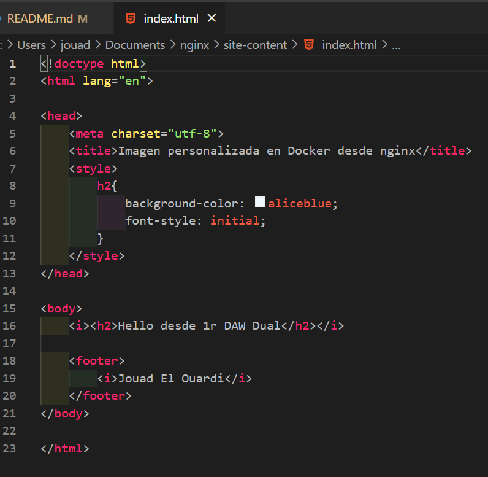
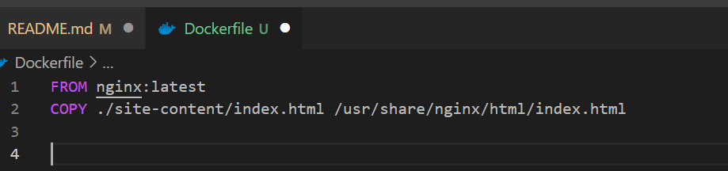
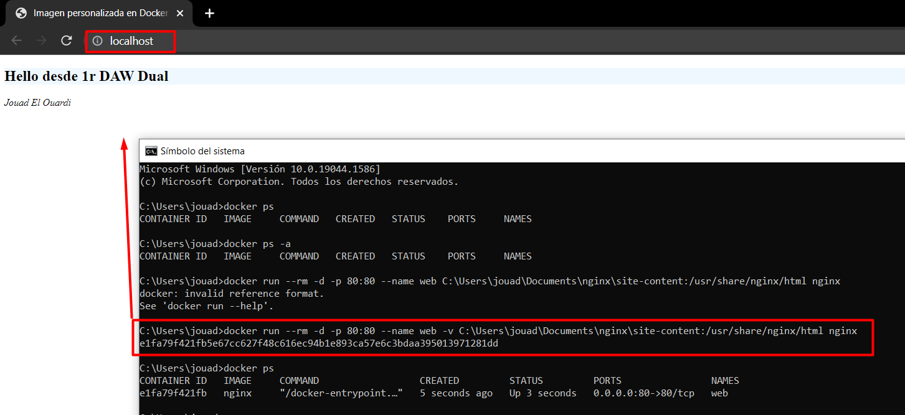
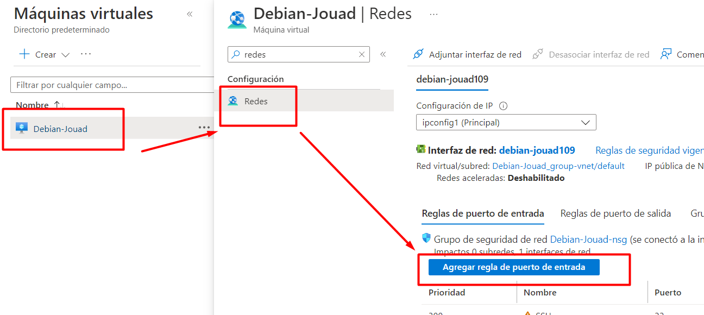
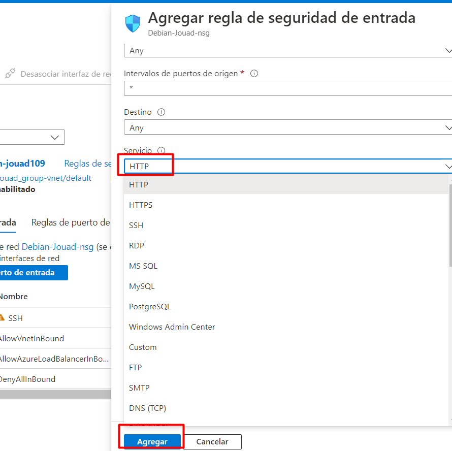

# Docker-Imagen-Nginx

## Instalación Nginx

**Recursos**: https://hub.docker.com/_/nginx 

```docker pull nginx```

Una vez tenemos instalado Nginx en nuestro docker ejecutamos el siguiente comando para tener la web en marcha:

```docker run --rm -d -p 8080:80 --name web nginx```



Para detenerlo:

```docker stop web```

## Agregar HTML personalizado

De forma predeterminada, Nginx busca en el directorio ```/usr/share/nginx/html``` dentro del contenedor los archivos para servir. Necesitamos poner nuestros archivos html en este directorio.

Dentro del directorio *Documents* creamos unon llamado *nginx* y otro llamado *site-content*.


Ahí crearemos un fichero .html, en este caso desde **Visual Studio**, podemos personalizarlo a nuestro gusto.





Para el fichero **Dockerfile**, también desde ahí.



Entonces ejecutamos el comando con nuestra ruta y podremos visualizar el html que hemos personalizado en nginx.



**IMPORTANTE: Tener el puerto 80:80 libre, de no ser el caso, lo recomendable es reiniciar la máquina.**


## ¿Es posible publicar la web de pruebas mediante Microsoft Azure? 

Si, desde nuestra máquina accedemos a redes y *Agregar regla de puerto de entrada*



Cambiamos el servicio a HTTP y lo agregamos.




## Bibliografía 

Fuente: https://github.com/maximofernandezriera/Ciberseguridad-PePS/blob/master/_posts/2021-01-12-nginx.md 
